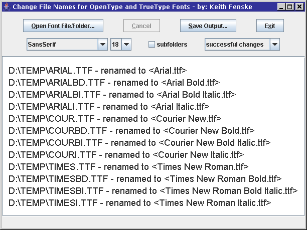

### Font Rename (Java)

by: Keith Fenske, https://kwfenske.github.io/

FontRename is a Java 1.4 application to rename OpenType and TrueType font files
with their internal "font full name" using only plain text characters (ASCII)
plus an extension for the type (OTF, TTC, TTF), or using the full Unicode
character set in languages like Arabic, Chinese, Japanese, Korean, and Russian.
This gives consistent names to font files, no matter what their source. The
contents of the files are not changed, only the names in the file directory.
Don't use this program on system folders with installed fonts.

Download the ZIP file here: https://kwfenske.github.io/font-rename-java.zip

Released under the terms and conditions of the Apache License (version 2.0 or
later) and/or the GNU General Public License (GPL, version 2 or later).

